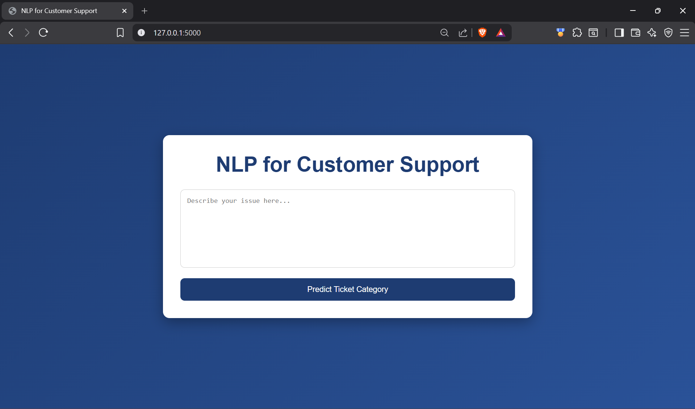
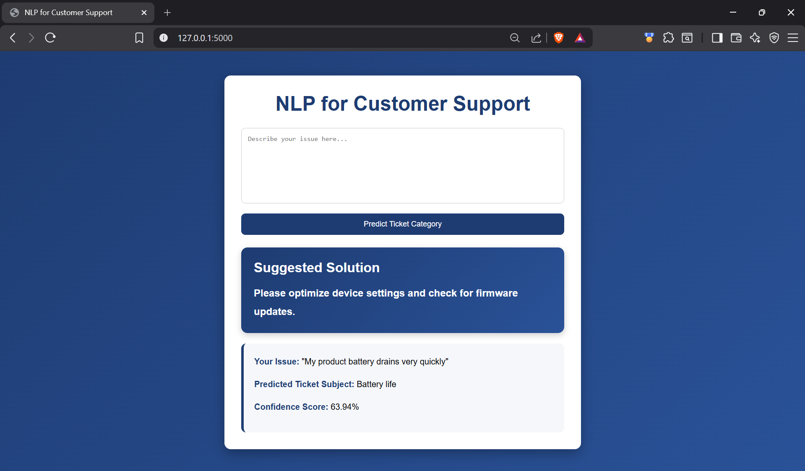

# NLP for Customer Support

NLP for Customer Support is a web-based application that uses Machine Learning and Natural Language Processing (NLP) to classify customer support issues and generate automated responses.

The application takes customer issues as input, predicts the support ticket category, and provides a suggested solution instantly.

---

# Problem Statement

Customer support teams receive a large number of customer issues daily.  
Manually reading and categorizing these tickets takes time and reduces efficiency.

This project automates customer support ticket classification using NLP techniques to:

- Categorize customer support tickets
- Reduce response time
- Improve support efficiency
- Generate automated replies

---

# Features

- Customer issue classification
- Automated support replies
- Real-time prediction system
- Web-based user interface
- Confidence score prediction
- Text preprocessing and cleaning
- Responsive and modern UI

---

# Technologies Used

| Category | Technology |
|----------|-------------|
| Programming Language | Python |
| Machine Learning | Scikit-learn |
| NLP Library | NLTK |
| Vectorization | TF-IDF |
| ML Algorithm | Logistic Regression |
| Backend | Flask |
| Frontend | HTML, CSS |

---

# Dataset

The project uses a customer support ticket dataset from Kaggle.

Dataset contains:

- Ticket Subject
- Ticket Description
- Ticket Type

The model is trained using:

```text
Ticket Subject + Ticket Description
```

to predict customer support ticket subjects.

---

# NLP Preprocessing

The following preprocessing steps are used:

- Convert text to lowercase
- Remove punctuation
- Remove numbers
- Remove emails
- Remove stopwords
- Tokenization
- Text cleaning

---

# Machine Learning Workflow

1. Load dataset
2. Preprocess text data
3. Apply TF-IDF vectorization
4. Train Logistic Regression model
5. Evaluate model accuracy
6. Save trained model
7. Deploy using Flask web application

---

# Model Details

| Component | Details |
|-----------|----------|
| Vectorizer | TF-IDF |
| Algorithm | Logistic Regression |
| N-Grams | Unigrams + Bigrams |
| Accuracy | ~99% |

---

# Project Structure

```text
NLP-CUSTOMER-SUPPORT/
│
├── dataset/
│   └── customer_support_tickets.csv
│
├── model/
│   ├── customer_support_model.pkl
│   └── tfidf_vectorizer.pkl
│
├── outputs/
│   ├── Home.png
│   └── Prediction.png
│
├── templates/
│   └── index.html
│
├── venv/
│
├── .gitignore
├── app.py
├── README.md
├── requirements.txt
└── train_model.py
```

---

# Installation

## Clone Repository

```bash
git clone <repository-url>
cd NLP-Customer-Support
```

---

# Create Virtual Environment

```bash
python -m venv venv
```

---

# Activate Virtual Environment

## Windows

```bash
venv\Scripts\activate
```

## Linux / Mac

```bash
source venv/bin/activate
```

---

# Install Required Libraries

```bash
pip install -r requirements.txt
```

---

# Train the Model

```bash
python train_model.py
```

This creates:

- customer_support_model.pkl
- tfidf_vectorizer.pkl

inside the `model/` folder.

---

# Run the Application

```bash
python app.py
```

---

# Open in Browser

```text
http://127.0.0.1:5000
```

---

# Example Inputs

## Example 1

```text
I cannot access my account
```

## Example 2

```text
Payment failed while placing order
```

## Example 3

```text
My product battery drains very quickly
```

---

# Example Output

The application displays:

- Suggested solution
- Predicted ticket subject
- Confidence score
- Customer issue summary

---

# Automated Responses

The application generates automated replies based on the predicted category.

Example:

| Category | Reply |
|----------|-------|
| Account access | Reset password or verify credentials |
| Battery life | Optimize settings and update firmware |
| Payment issue | Retry transaction or contact bank |

---

# Screenshots

## Home Page



---

## Prediction Result



---

# Future Improvements

- Chatbot integration
- Deep Learning models
- Multi-language support
- Dashboard and analytics
- REST API integration
- Database support

---

# Requirements

```text
pandas
numpy
nltk
scikit-learn
flask
joblib
```